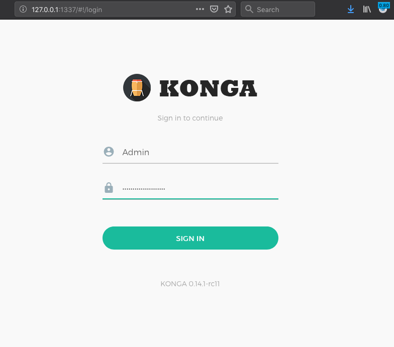
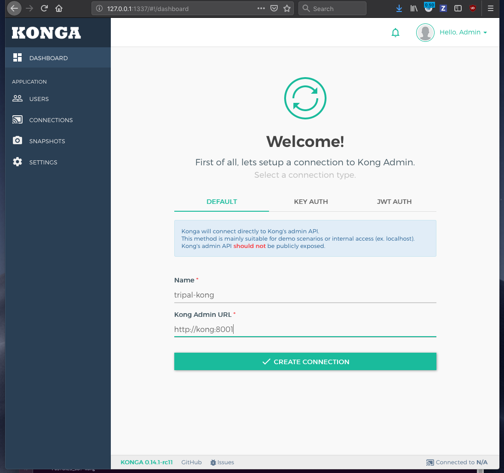

###Getting started with konga.

Point your browser to port 1337 (default)
and create a new adminstrative user.

You should be prompted to login with the recently created user.

You will be prompted to add a kong instance, by default, the admin
port of kong will be on port 8001.

You should then be taken to the admin panel for the kong instance
you have setup:

The sidebar options of note are as follows:

| Option | Description |
| ------ | ----------- |
| Info   | Pretty format of same information available at localhost:8001|
| Service | Manage Services |
| Routes | Manage existing routes to services |
| Consumers | Manage user access to routes |
| Plugins | Manage active plugins |
| Upstreams | Manage server connections |

Note that at the moment, kong allows for one route -> one service
but one service can have many routes. Development is in place for
a compositor plugin (one route -> many services) but at the time it
is suggested to write an interface service if you wish for a route to
query multiple endpoints.

Configuration documentation for kong can be found here:
[Kong Documentation](https://docs.konghq.com/1.0.x/getting-started/configuring-a-service/)

