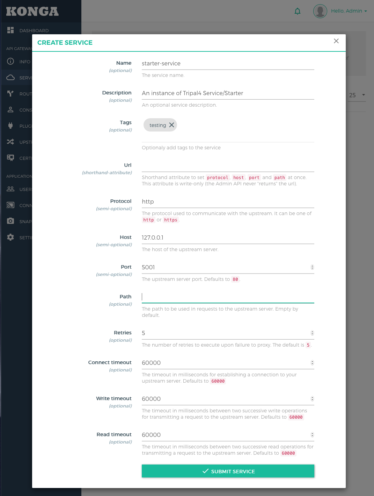
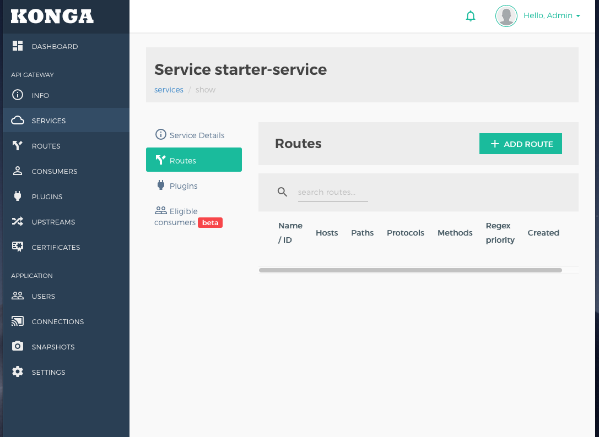

## Registering services with Kong via command line

After starting up the Services/starter and Gateway containers, you will need 
to attach the starter service to Kong.

Note that Services/starter has been added to the tripal-kong network in the 
docker-compose.yml file in Services/starter with this section:
```
networks:
  default:
    external:
     name: tripal-kong
```

Below is a description for an alternative method for adding a service to the 
network.

First, verify that the starter service is on the tripal-kong network and is 
running:

    $ curl http://localhost:5000
    Hello, World!
    $ docker network inspect tripal-kong
    [
      {
        "Name": "tripal-kong",
        ...
            "Name": "starter_starter_service_1"
        ...
      }
    ]
Note that the service is named **"starter_starter_service_1"**.

Create a Kong service for  Services/starter and name it starter-test:
```
    $ curl -i -X POST \
       --url http://localhost:8001/services/ \
       --data 'name=starter-test' \
       --data 'url=http://localhost@starter_starter_service_1:5000'
```
Test to make sure it's there:

    $ curl --url http://localhost:8001/services/

Add a route to the starter-test service, giving it the path, /hello:

    curl -i -X POST \
      --url http://localhost:8001/services/starter-test/routes \
      --data 'paths[]=/hello'
Test to make sure it's there:

    $ curl --url http://localhost:8001/services/starter-test/routes
    {"next":null,"data":[{"created_at":1546909510,"strip_path":true,
    "preserve_host":false,"regex_priority":0,"updated_at":1546909510,
    "paths":["\/hello"],"service":{"id":"e8f6e1ab-a242-4109-a53f-d66cca694b49"},
    "protocols":["http","https"],"id":"75821ccf-95e8-406d-8ecd-40ccdbb3275f"}]}
  
Now try calling the starter service via Kong:

    curl http://localhost:8000/hello
    Hello, World!
    
    
## Registering services with the Kong GIU, Konga.

The configuration code for including Konga with the Kong container is in 
Gateway/docker-compose.yml. Uncomment the lines starting from:

    #  konga:
    #    image: pantsel/konga:next
    #    restart: always
    #    networks:
    #        - tripal-kong
    ...
Then stop the Kong container and rebuild it:

    $ cd Gateway/
    $ docker ps  # to get id for the Kong services
    CONTAINER ID        IMAGE                     COMMAND                  CREATED             STATUS                       PORTS                                             NAMES
    f24957b2e0b4        kong:latest               "/docker-entrypoint.…"   2 hours ago         Up About an hour (healthy)   0.0.0.0:8000-8001->8000-8001/tcp, 8443-8444/tcp   gateway_kong_1
    35eb54523fac        postgres:9.6-alpine       "docker-entrypoint.s…"   3 hours ago         Up About an hour (healthy)   0.0.0.0:5433->5432/tcp                            gateway_kong-database_1
    ...
    $ docker stop f24957b2e0b4   # kong
    $ docker stop 35eb54523fac   # kong's postgres instance
    $ docker-compose up
    $ docker ps
    
Point your browser to port 1337 (default)
and create a new adminstrative user.  

**WARNING: be sure your password is at least 12 characters long and is not the
same as your user name. For example, admin/adminadminadmin is accepted.** If
your password fails to meet the requirements you will simply see an error dump
after creating the account.

**New user account form:**


You should then be prompted to login with the recently created user. If instead 
you see an error dump, your username or password did not meet Konga's 
specifications (a bug that the developers really should fix....)


You will first be prompted to add a kong instance. By default, the admin
port of kong will be on port 8001.


From here you should be taken to the admin panel for the kong instance
you have set up:


The sidebar options of note are as follows:

| Option | Description |
| ------ | ----------- |
| Info   | Pretty format of same information available at localhost:8001|
| Service | Manage Services |
| Routes | Manage existing routes to services |
| Consumers | Manage user access to routes |
| Plugins | Manage active plugins |
| Upstreams | Manage server connections |

Note that at the moment, kong allows for one route -> one service
but one service can have many routes. Development is in place for
a compositor plugin (one route -> many services) but at the time it
is suggested to write an interface service if you wish for a route to
query multiple endpoints.

Configuration documentation for kong can be found here:
[Kong Documentation](https://docs.konghq.com/1.0.x/getting-started/configuring-a-service/)

### Adding a service via Konga
First you must start your service. The service must have been added to the 
tripal-kong network. See instructions at the top of this README for how to do 
this with a docker-compose.yml file, and below for an alternative method.

Add a service using Konga's New Service form.  



will add the service to Kong's service pool.

### Adding a route via Konga

Adding a route in the Konga GUI requires that you add it from the service 
itself, not the routes tab.



Fill in the form to defines a path to the service. **Note that this step has 
not worked with latest version as of Jan 8th, 2018 on Mac OS X.** Note also 
that you will need to hit CR for each field you type into.

Set Paths: /hello

The service should now be reachable at http://localhost:8000/hello


## Alternative methods for adding services to Kong

To start a service, using `docker run` and the starter service as an example:
```
docker run --network=tripal-kong --name=starter-service -p 5000:5000 tripal/starter

```

**OR,** if starting the service using a docker-compose.yml file, include the 
following in the file as is the case for the starter service:
```
networks:
  default:
    external:
     name: tripal-kong
```

Check that the service has been added to the network:
```
docker network inspect tripal-kong
```

The service should now be listed alongside the gateway containers.
Now restart the kong container so that its hosts file is updated:
```
docker restart kong
```
**If you don't want to restart kong** you can use the IP address of 
the service container as found from inspecting the network, or use the
IP of your computer if the service ports are exposed to the outside
world.

Using the toy service in Services/starter as an example,
navigate to the service directory and start the service if it isn't already up:
```
docker-compose up -d
```
This should start the service as something like `starter-starter-service_1`
**Note that the service is listening on port 5000.**  

Verify with:

    $ curl http://localhost:5000

**Add the service to Kong from the command line:**

    curl -i -X POST \  
       --url http://localhost:8001/services/ \  
       --data 'name=sample-service' \  
       --data 'url=http://starter-starter-service_1:5000'  


